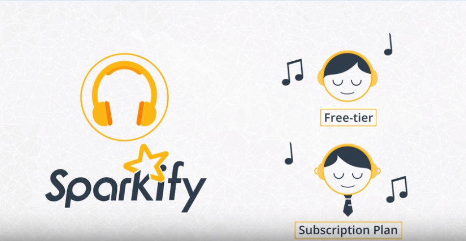
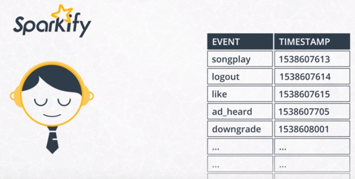
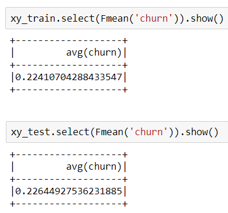
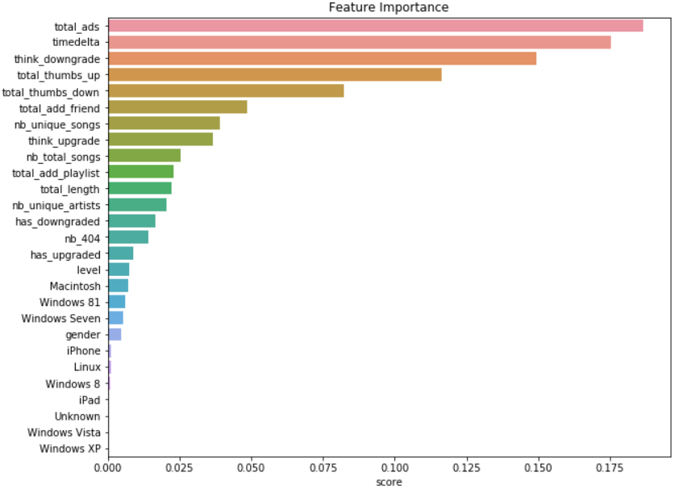

# Udacity DataScience nanodegree project - Capstone Project: churn prediction
## Table of contents
* [1. Context - Objectives](#1-context---objectives)
* [2. About the data](#2-about-the-data)
* [3. Modeling](#3-modeling)
* [4. Results](#4-results)
* [5. Technical section](#5-technical-part)

---

## 1. CONTEXT - OBJECTIVES
### Context
This project is only for educational purposes. I did it while I was following the Udacity `DataScience nanodegree`.  
This is the capstone project, the final one out of a series of seven projects. We are free to choose any topic of interest
but Udacity is also providing data to work with.  
I chose to use the data provided for 2 reasons:
* it is a new problem that I have never met (compared to image classification for example) and I found this topic interesting in terms of business use case
* there is an additional challenge as the data is very huge (more than 26 million rows) so it does not fit on a single machine and
we have to use other techniques/tools such as Spark (an open-source distributed general-purpose cluster-computing framework).

It is the occasion for me to learn more about this famous tool. Manipulating large and realistic datasets with Spark which has become in few years
one of the highest-demand skills in the field of data. Here we will use it to engineer relevant features for predicting churn.

We will also have to use Spark MLlib to build machine learning models, far beyond what could be done with non-distributed technologies
like scikit-learn.


### Business use case
In this project our goal is to predict user churn. We work for a fictive company called _"Sparkify"_, a digital music service similar
to famous Spotify or Deezer.  

Many of the users stream their favourite songs with our _"Sparkify"_ service every day using either the free tier that places advertisements 
between the songs or using the premium subscription model where they stream music as free but pay a monthly flat rate.  
Users can upgrade, downgrade or cancel their service at any time so it is crucial to make sure our users love our service.



Evey time a user interacts with the service while they are playing songs, logging out, liking a song with a thumbs up, hearing an ad 
or downgrading their service it generates data.  
All this data contains the key insights for keeping our users happy and helping our business thrive.



Our job in the data team is to predict which user are at risk to churn, either downgrading from premium to free tier or cancelling 
their service altogether.
If we can accurately identify these users before they leave, business teams can offers them discounts and incentives potentially
saving our business millions in revenue.


### Objectives
As a student here are the mandatory steps we have to follow to validate our nanodegree:
* **Define the problem to solve** and investigate potential solutions.
* Analyze the problem through visualizations and **data exploration** to have a better understanding of what algorithms and features
are appropriate for solving it.
* **Implement the algorithms and metrics of our choice**, documenting the preprocessing, refinement, and post-processing steps along the way.
* **Collect results about our findings**, visualize significant quantities, **validate/justify our results**, and make any concluding 
remarks about whether our implementation adequately solves the problem.
* **Construct a blog post** to document all of the steps from start to finish

---
## 2. ABOUT THE DATA
### Global overview
We are provided 2 datasets in JSON format:
* a "tiny" one (128MB although) that can be used on machine to start the exploration phase.
* a full dataset (12GB) that has to be deployed within a Spark cluster on the cloud (AWS, IBM, whatever).

Those datasets are available on S3:
* 128MB subset: [s3n://udacity-dsnd/sparkify/mini_sparkify_event_data.json](s3n://udacity-dsnd/sparkify/mini_sparkify_event_data.json)
* full 12GB dataset: [s3n://udacity-dsnd/sparkify/sparkify_event_data.json](s3n://udacity-dsnd/sparkify/sparkify_event_data.json)

Due to the size of those datasets, they are not provided within this repository but you can find in the `data` folder 2 datasets corresponding
to the result of my feature engineering for both datasets:
* `df_final_subset128.csv` for the tiny dataset
* `df_total_12GB.csv` for the full dataset

### Imbalanced data: drawbacks
In our problem (fortunately for _Sparkify_), there are more users that stay than users who churn. So our class is imbalanced.  
**This is an issue in Machine Learning** because we have less examples to learn well and if our model
often see the same value it will obviously 'learn' that and tend to predict this value.  
**That is why we have to wisely choose the performance metric!**.  

#### Which performance metric?
If we choose `accuracy` as the performance metric to check whether we classify well or not, a dummy classifier that always
predict the most frequent class will have a good score but in the end we will have built a very poor model.
  
When data are imbalanced we can use other metrics such as:
* ***Precision:*** among all the positive predictions made by the model, we count how many of them were actually positive
in the train/validation/test dataset. This is a ratio and the higher the better because it means that our model is very
precise. In other words, when the model says it is True, it is actually True (in this case there are few _"False
Positives"_).
* ***Recall:*** among all the real positive values in the train/validation/test dataset, how many of them did our model
classified as positive? This metric indicates how good is our model to "catch them all". Indeed, the model can be very
precise (when it says it is positive, it is correct) but could still miss a lot of positive samples. And this is not 
good neither. Recall is also a ratio and the higher the better (when it is high there are few _"False Negatives"_).

Precision has to be chosen when there is a big impact with False Positives.  
Recall has to be chosen when there is a big impact with False Negatives. 
That is why, depending on the use case, we might want to focus on `Recall` rather than `Precision` or vice-versa.  
> For example in medical domain, when algorithm says the person has/does not have cancer, we want this information to be as
accurate as possible (you can easily imagine the impacts when this is wrong), this is the _Precision_.  
But we also want to avoid saying someone that he does not have cancer whereas he actually has one (this is the worst 
case scenario). So perhaps in this case we want to focus more on _Recall_ (ensure we catch all of them) even if it means
that it is less precise.

If we do not want to choose between _Precision_ or _Recall_ because both are kind of equally important we can choose to
use the ***F1-Score*** metric which is the harmonic mean of both:  
> ```F1 score = 2x ((Precision x Recall)/(Precision + Recall))```

**F1-Score will be the selected metric in our case.**

#### Ensure that we have enough data to train on
When data are imbalanced there is also another issue: how to ensure that in our training dataset we will have enough
samples of each class to train on and then be able to learn and classify correctly?  
The split between train and test dataset cannot then be totally random. There is this *[scikit-multilearn package](http://scikit.ml/index.html)*
that can help to [stratify the data](http://scikit.ml/stratification.html).  
We can also use other techniques such as:
* ***oversampling***: here we duplicate the data for classes that appears less so that in the end there are more of them and
algorithm can learn. The drawback is that depending on the use case, as it is the same data that is duplicated, the 
learning can have a big bias.
* ***undersampling***: randomly remove some occurrences of classes that appears the most. This is also a good idea but it can
lead us to a lot of data loss depending on how huge is the gap between classes.
* we could mix both oversampling and undersampling

Fortunately, in our case there is a single class and it is binary (0/1), the random split between training and test datasets gave good results:


---
## 3. MODELING
### Eligible models
As it is a supervised classification problem I will take the **Logistic Regression** algorithm as a baseline.  
This baseline will be compared to tree based algorithms which are known to handle pretty well 
imbalanced data (such as _Random Forest_ for example) and an ensembling boosting one: _Gradient-Boosted Tree_.  
All those models are part of the Spark ML lib so we can use them.

### Feature Engineering
A lot of features have been extracted from the `Data Exploration phase` (for more details, please refer to this
[notebook](notebooks/2_Sparkify_Data_Exploration.ipynb)). In few words, we have:
* `level` of subscription
* `registration` time for the user
* `engagement` of the user with the number of artists, songs or even the total length of music listened, add to playlist number
* `social interactions` with likes/dislikes, friends, etc
* `upgrade/downgrade` the subscription level
* `user operating system` which could help us to identify users of a version that does not give entire satisfaction
* `errors_encountered` which could help us to identify users who had several issues and then maybe quit

---
## 4. RESULTS
| Model name                          | Computation time | F1-Score | Weighted Precision | Weighted Recall |
|-------------------------------------|------------------|----------|--------------------|-----------------|
| Logistic Regression                 | 23.6s            | 0.75     | 0.78               | 0.8             |
| Random Forest                       | 17.2s            | 0.79     | 0.82               | 0.82            |
| Gradient-Boosted Tree               | 1min 1s          | 0.82     | 0.83               | 0.84            |
| Tuned Gradient-Boosted Tree         | 24min 48s        | 0.82     | 0.83               | 0.84            |

***Note:*** With the parameters by default the **Gradient-Boosted Tree is our best model with a F1-Score=0.82**. Even if it 
is the algorithm that takes much more time to run (due to the sequence of tree addition), we can afford it because the performance
is very high compared to others solutions that have been tried.

### Features importance
As we are using a tree-based solution we can plot a graph with the 'features importance': it will then gives us more information
about what, in the dataset, contributed the most to the churn prediction.   


***Observations:***  
_In this dataset and with the features I have created:_
* **the one that contributes the most to determine if a user will churn or not is
the total number of ads listened**. That would mean that users are fed up with ads and decide to quit.
* The second one is the **number of days of the service** (probably the less you use the more you might churn - we have seen that during
the exploration phase)
* Just after comes the **social interactions with the service (either thumbs up or down) meaning that you are satisfied or not with the 
songs that are suggested** by the service for example.
* On the other side, we can see that the **user's operating system has few importance**. As it was quite painful to collect I suggest that
we get rid of that information as a further improvement of this model. The data collect pipeline would be much more faster.


### Conclusion
We now have a model that can detect churn users with a pretty good performance (F1-Score is 0.82 with good precision and recall).
We could use this model on the whole database of users, classify them and give the list of users that might soon churn to a commercial/marketing
service that can contact them and propose incentives for them to stay.

---
## 5. TECHNICAL PART
### Dependencies & Installation 
Unfortunately, as this project was made within Udacity workspace there is no Conda environment file to provide but,
apart from [PySpark](https://spark.apache.org/docs/latest/api/python/index.html), there is nothing very new.  
Basically, this project requires **Python 3.7** in addition to common datascience packages (such as 
[numpy](https://www.numpy.org/), [pandas](https://pandas.pydata.org/), 
[matplotlib](https://matplotlib.org/), 
[seaborn](https://seaborn.pydata.org/) and so on).

For modeling, this project is using Spark ML.

### Directory & code structure
Here is the structure of the project:
```
    project
      |__ assets    (contains images displayed in notebooks)
      |__ data      (refined data used after feature engineering part)
      |__ notebooks  (contains all notebooks)
```

### Code
This project is only made with notebooks. They have been splitted into different ones, depending on their main goal:
* [1. Data Understanding](notebooks/1_Sparkify_Data_Understanding.ipynb)
* [2. Data Exploration](notebooks/2_Sparkify_Data_Exploration.ipynb)
* [3. Feature Engineering and Modeling on small dataset](notebooks/3_Sparkify_Modeling.ipynb)
* [4. Modeling on full dataset](notebooks/4_Sparkify_Modeling_Full_Dataset.ipynb)

Note that there are 2 additional notebooks which are related to the full dataset exploration on the cloud EMR cluster:
* [Apply the Feature Engineering on full dataset](notebooks/APPENDIX_Sparkify_EMR.ipynb)
* [Full Dataset Data Exploration](notebooks/APPENDIX_Full_Dataset_Data_Exploration.ipynb)


### Help to deploy on the cloud
I have chosen AWS EMR as the cloud solution to explore the full dataset.  
Those resources might be helpful to explore the full dataset within a cluster deployed on the cloud:
* [Getting started with PySpark on Amazon EMR](https://towardsdatascience.com/getting-started-with-pyspark-on-amazon-emr-c85154b6b921)
* [Use PySpark with a Jupyter notebook in an AWS EMR cluster](https://towardsdatascience.com/use-pyspark-with-a-jupyter-notebook-in-an-aws-emr-cluster-e5abc4cc9bdd)